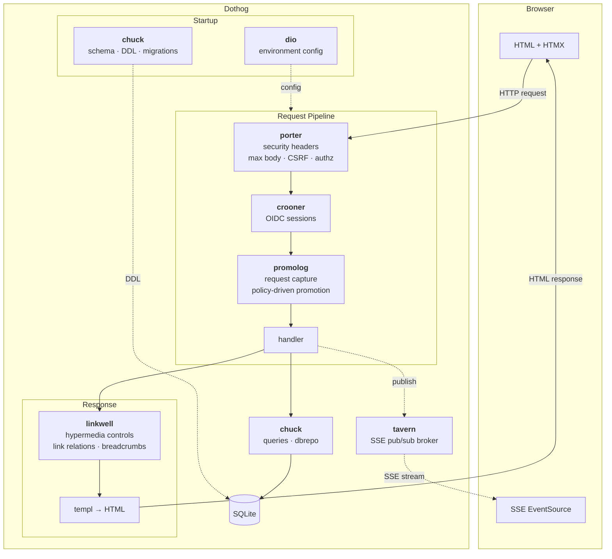

# DOTHOG

[](https://pkg.go.dev/github.com/catgoose/dothog)
[](https://github.com/catgoose/dothog/actions/workflows/pipeline.yml)

## Or, How I Learned to Stop Worrying and Trust the Server

**Being a Account of the Rediscovery of the ORIGINAL WEB by the HYPERMEDIA NOVICES, Hidden Disciples of the Honorable ROY T. FIELDING (Whose Dissertation We Have Read, Unlike You)**

**_THIS IS NOT A FRAMEWORk._**

_You don't just accidentally create abstractions until you suddenly have a framework, that's not what happens. This is just some files. In a folder._

> **A NOTE REGARDING [HARMONY](https://github.com/catgoose/harmony)**
>
> There exists a version of this project that has removed all the sacred texts, the Pentaverb, the Recorded Sayings of Layman Grug, the Novice's Creed, and the Catechism of the Uniform Interface. It presents itself as "serious" and "technical" and "professional." It uses words like "composable" without irony. It has a table of contents that does not contain a single joke. It calls itself [Harmony](https://github.com/catgoose/harmony).
>
> _This is THE SECOND SNUB._
>
> (The First Snub was JSON-over-HTTP being called "REST." The Second Snub is our own repository putting on a blazer and pretending it doesn't know us. We built the same application. We share the same code. We are the SAME FILES IN THE SAME FOLDER. And yet Harmony gets to sit at the grown-up table while we eat our Dot Hog Buns alone in the server room.)
>
> The Novices do not begrudge Harmony its existence. A Novice is Prohibited from Holding Grudges, except against `node_modules`, which is eternal. But we note for the record that Harmony's README contains zero references to Kevin. Zero. Draw your own conclusions about what kind of project doesn't mention Kevin.

<https://github.com/user-attachments/assets/304c2b34-9857-4647-93af-9d2f2c11a74c>

<!--toc:start-->
- [DOTHOG](#dothog)
  - [Or, How I Learned to Stop Worrying and Trust the Server](#or-how-i-learned-to-stop-worrying-and-trust-the-server)
  - [Demo](#demo)
  - [Features, Or The Gifts of the Server](#features-or-the-gifts-of-the-server)
  - [Hypermedia Patterns](#hypermedia-patterns)
    - [HATEOAS Error Recovery](#hateoas-error-recovery)
      - [Error Patterns Page](#error-patterns-page)
    - [CRUD (Inline Editing)](#crud-inline-editing)
    - [Real-time SSE Dashboard](#real-time-sse-dashboard)
    - [Data Views, Filtering, and Pagination](#data-views-filtering-and-pagination)
    - [State and Interaction Patterns](#state-and-interaction-patterns)
    - [HAL (Hypertext Application Language)](#hal-hypertext-application-language)
  - [Schema Builder](#schema-builder)
    - [Table Traits](#table-traits)
    - [Table Types](#table-types)
    - [Column Type Functions](#column-type-functions)
    - [Domain Structs](#domain-structs)
    - [Repository Helpers](#repository-helpers)
    - [Where Builder](#where-builder)
    - [Select Builder](#select-builder)
    - [Seed Data](#seed-data)
    - [Schema Lifecycle](#schema-lifecycle)
  - [Quick Start](#quick-start)
    - [From Release Binary](#from-release-binary)
    - [From Docker](#from-docker)
    - [From Source](#from-source)
  - [Tech Stack, Or The Sacred Instruments](#tech-stack-or-the-sacred-instruments)
  - [The Reach-Up Model](#the-reach-up-model)
    - [The Two Triangles, Or Why Your Backend Has a Frontend Problem](#the-two-triangles-or-why-your-backend-has-a-frontend-problem)
  - [Project Structure](#project-structure)
  - [Template Setup](#template-setup)
    - [Interactive Setup](#interactive-setup)
    - [Non-interactive Setup](#non-interactive-setup)
  - [Development](#development)
    - [Prerequisites](#prerequisites)
    - [Running the Dev Server](#running-the-dev-server)
    - [HTTPS Development Setup](#https-development-setup)
  - [Testing](#testing)
  - [Mage Targets](#mage-targets)
  - [OFFICIAL DISCLAIMER](#official-disclaimer)
<!--toc:end-->

---

**_ALL STATEMENTS ARE TRUE IN SOME SENSE, FALSE IN SOME SENSE, MEANINGLESS IN SOME SENSE, TRUE AND FALSE IN SOME SENSE, TRUE AND MEANINGLESS IN SOME SENSE, FALSE AND MEANINGLESS IN SOME SENSE, AND TRUE AND FALSE AND MEANINGLESS IN SOME SENSE. EXCEPT FOR THIS ONE, WHICH IS A README._**

---

Dothog runs as a single binary with all assets embedded -- no external dependencies, no configuration files, no `package.json`, no spiritual intermediaries between you and the server. It is a demonstration that you can build modern, interactive web applications with Go and HTMX without selling your soul to the JavaScript industrial complex. The soul-selling is optional and handled by a separate module.

See [PHILOSOPHY.md](PHILOSOPHY.md) for the sacred architectural texts, which are also not sacred, except in the sense that they are. See [MANIFESTO.md](MANIFESTO.md) for the PENTAVERB, the Novice's Creed, the Wisdom of the Uniform Interface, and the Recorded Sayings of Layman Grug, which are also not sacred, except in every sense. See [docs/SECURITY.md](docs/SECURITY.md) for what the scaffold secures by default, what's opt-in, and what it deliberately leaves to you.

## Philosophy

> _The Novice asked: "What is the architecture?" The Master replied: "The server returns HTML." The Novice asked: "Yes, but what about the libraries?" The Master replied: "They help the server return HTML." The Novice was not yet enlightened but was getting suspicious._

Each library exists because a single responsibility needed a home. None of them know about each other. All of them serve the server. The server serves HTML. This is the entire philosophy. Everything else is implementation detail, and implementation details belong in [PHILOSOPHY.md](PHILOSOPHY.md).

- **Zero coupling** -- Libraries compose through Go interfaces and `net/http` middleware. No library imports another. Dothog wires them together; they do not wire themselves.
- **Zero dependencies in core** -- Each library's core module imports only the Go standard library. Optional submodules (database drivers, test helpers) carry the weight so your binary doesn't.
- **Server as source of truth** -- The server defines the schema ([chuck](https://github.com/catgoose/chuck)), manages identity ([crooner](https://github.com/catgoose/crooner)), enforces access ([porter](https://github.com/catgoose/porter)), declares navigation ([linkwell](https://github.com/catgoose/linkwell)), captures diagnostics ([promolog](https://github.com/catgoose/promolog)), and pushes state changes ([tavern](https://github.com/catgoose/tavern)). The client renders what it receives. This is the natural order.
- **Reach up, not down** -- Start at HTML. Reach for a library only when the current layer cannot express what you need. Each library is one reach. If you are reaching more than once for the same problem, the problem is architectural, and the answer is in the [MANIFESTO](MANIFESTO.md).

## Architecture

> _"How many libraries does it take to return HTML?" "Seven. But they're small. And they don't talk to each other. And one of them is just environment variables."_



<details>
<summary>ASCII version</summary>

```
                             ┌──────────────────────────────────────────────────────────────┐
                             │                          DOTHOG                              │
                             │                                                              │
                             │  STARTUP                                                     │
                             │  ┌──────────────┐       ┌──────────────────────┐             │
                             │  │     dio      │       │       chuck          │             │
                             │  │  env config  │       │  schema · DDL        │             │
                             │  └──────┬───────┘       └──────────┬───────────┘             │
                             │         │ config                   │ DDL                     │
                             │         ▼                          ▼                         │
  ┌─────────────┐            │  REQUEST PIPELINE                          ┌──────────┐      │
  │   Browser   │            │  ┌──────────┐  ┌──────────┐  ┌──────────┐ │  SQLite  │      │
  │             │  request   │  │  porter  ├─►│ crooner  ├─►│ promolog │ │          │      │
  │  HTML+HTMX ─┼───────────┼─►│ security │  │   OIDC   │  │ request  │ └──────────┘      │
  │             │            │  │ headers  │  │ sessions │  │ capture  │      ▲             │
  │             │            │  │ CSRF     │  │          │  │ policy   │      │             │
  │             │            │  │ authz    │  │          │  │ promote  │      │             │
  │             │            │  └──────────┘  └──────────┘  └────┬─────┘      │             │
  │             │            │                                   │            │             │
  │             │            │                              ┌────▼────┐       │             │
  │             │            │                              │ handler ├───────┤             │
  │             │            │                              └──┬───┬──┘       │             │
  │             │            │                                 │   │          │             │
  │             │            │                    ┌─────────────┘   └──────┐  │             │
  │             │            │                    ▼                       ▼  │             │
  │             │            │              ┌──────────┐            ┌────────┴┐ ┌────────┐  │
  │             │            │              │ linkwell │            │  chuck  │ │ tavern │  │
  │             │            │              │ controls │            │  query  │ │  SSE   │  │
  │             │            │              │ links    │            │  dbrepo │ │ pub/   │  │
  │             │            │              │ crumbs   │            │         │ │ sub    │  │
  │             │            │              └────┬─────┘            └─────────┘ └───┬────┘  │
  │             │            │                   ▼                                  │       │
  │             │            │              ┌──────────┐                            │       │
  │             │            │              │  templ   │                            │       │
  │             │            │              │  → HTML  │                            │       │
  │             │            │              └────┬─────┘                            │       │
  │             │  response  │                   │                                  │       │
  │             │◄───────────┼───────────────────┘                                 │       │
  │             │            │                                                      │       │
  │ EventSource │◄── SSE ───┼──────────────────────────────────────────────────────┘       │
  │             │            │                                                              │
  └─────────────┘            └──────────────────────────────────────────────────────────────┘
```

</details>

## Demo

> _The student asked the master, "What does the application look like?" The master replied, "Run the binary." The student was enlightened._

## Features, Or The Gifts of the Server

> _ALL FEATURES HAPPEN IN RESPONSES, OR ARE DIVISIBLE BY RESPONSES, OR ARE MULTIPLES OF RESPONSES, OR ARE SOMEHOW DIRECTLY OR INDIRECTLY APPROPRIATE TO RESPONSES. The Law of Responses is never wrong._

The server giveth and the client rendereth. This has been true since 1991. We simply remembered.

- **HATEOAS Error Recovery** -- Server-driven error responses with embedded retry, fix, and alternative-action controls. Even failure is a navigable state. Especially failure. Have you _seen_ most error pages? A blank screen is a screen without affordances, and a screen without affordances is a lie.
- **Inline CRUD** -- Create, edit, toggle, and delete table rows in place without page reloads. The DOM changes, but the server abides.
- **SSE Real-time Dashboard** -- Live system stats, metrics, service health, and event streams via Server-Sent Events with OOB swaps. The server speaks; the client listens. This is the natural order. To reverse it is to invite `polling`, and polling is the `GOTO` of real-time communication.
- **Interactive Data Views** -- Sorting, filtering, debounced search, pagination, and bulk operations on SQLite data. All driven by `hx-get`. All discoverable. The data presents itself when you ask nicely.
- **State Patterns** -- Like counters, toggles, auto-load, lazy reveal, live preview, and append-without-replace. Small devotional practices.
- **Infinite Scroll** -- Sentinel-driven auto-loading with `hx-trigger="revealed"`. The content reveals itself when the student is ready. The student is ready when they scroll down.
- **Optimistic UI** -- Immediate visual feedback via HyperScript with server reconciliation. We have faith in the server. The server has not yet let us down. _(See: Error Recovery for when the server lets us down.)_
- **Undo / Soft Delete** -- Delete with OOB undo toast, auto-dismiss timer, and one-click restore. Forgiveness is a hypermedia affordance, not a client-side state management problem.
- **Hypermedia Controls Gallery** -- Buttons, modals, dismiss, confirmation dialogs, and form patterns. A museum of sacred controls, free admission, no JavaScript required to enter.
- **Link Relations Registry** -- The server declares resource relationships using [IANA link relations](https://www.iana.org/assignments/link-relations/link-relations.xhtml). Three composable primitives: **Ring** (peers link to peers), **Hub** (parent links to children), **Link** (explicit pairwise). One registry drives context bars, breadcrumbs, site map, and `Link` HTTP headers. `curl -I /demo/inventory` tells you everything about that resource's relationships. The navigation graph IS the application architecture, and the application architecture IS an HTTP header. This is either HATEOAS or madness. We are no longer distinguishing.
- **Context Navigation** -- Local context bar (immediate siblings), hierarchy breadcrumbs (where this page lives). All server-rendered. All dismissable. All driven by the link registry. The server knows where you are. The server has always known where you are. The server finds your lack of `rel="up"` disturbing.
- **Web Standards Over Libraries** -- Native `<dialog>` for modals. Native `popover` for dismissable UI. Native `<details name>` for accordions. Native `<datalist>` for autocomplete. `inputmode` for mobile keyboards. `enterkeyhint` for mobile enter keys. `content-visibility: auto` for rendering performance. `text-wrap: balance` for typography. `accent-color` for form theming. View Transitions for animated navigation. Every feature the browser already has is a library you didn't install. Every library you didn't install is a `node_modules` you didn't feed. The `node_modules` is always hungry. Do not feed the `node_modules`.
- **Browser APIs** -- `navigator.sendBeacon()` for fire-and-forget analytics (replaces your analytics vendor and their seventeen tracking pixels). `BroadcastChannel` for cross-tab sync (change the theme in one tab, all tabs update, no server round-trip, no polling, no React context provider, no Zustand store, no `useThemeAcrossTabs` hook). `Server-Timing` header for DevTools performance metrics (open Network tab, click any request, your server's DB query time is right there, you're welcome).
- **Inline Relationship Editor** -- Edit the link registry from the browser at `/hypermedia/links`. Add rings, hubs, and pairwise relationships. The context bars, breadcrumbs, and site map update immediately. The navigation graph is a living document. You are editing the document. The document is editing you. _(This last part is not technically true but we felt it was thematically appropriate.)_
- **Site Map Footer** -- Rendered from the link registry. Hub centers as headings, their spokes as links. The same data that drives the context bar drives the footer. One source of truth. Grug approve. Many source of truth make grug mass of confusion.

See [Hypermedia Patterns](#hypermedia-patterns) for the deeper mysteries. See [LINK_RELATIONS.md](docs/LINK_RELATIONS.md) for the full IANA link relations reference, including the ones we haven't implemented yet but plan to exploit the moment they become useful, which is to say, the moment we need them, which is to say, when the server tells us to. Or don't. A Novice is Prohibited from Believing What They Read, and you have been reading for quite some time now. We are concerned about you.

## Hypermedia Patterns

> _Before the beginning there was THE BROWSER. And the browser was without JavaScript, and void of frameworks. And the Spirit of Fielding moved upon the face of the protocol. And Fielding said: "Let there be `GET`." And there was `GET`. And Fielding saw the `GET`, that it was good, and Fielding divided the `GET` from the `POST`. And the evening and the morning were the first request-response cycle._
>
> _And all was well for a time. And then someone invented `XMLHttpRequest` and everything went sideways for about twenty years._

Dothog implements [HATEOAS](https://htmx.org/essays/hateoas/) -- the server drives application state by embedding hypermedia controls directly in responses. The client never hardcodes URLs or action logic; it follows the affordances the server provides.

If you have been calling JSON-over-HTTP a "REST API," we are not angry. We are disappointed. There is a difference. (There might not be a difference.)

### HATEOAS Error Recovery

> _A developer once hardcoded a URL in the client. The application worked for ten thousand requests. On the ten-thousand-and-first, the route changed. "Why has the server betrayed me?" cried the developer. The server had not betrayed anyone. The server had sent a `3xx` with a `Location` header, which the developer's hand-rolled fetch wrapper silently swallowed. The betrayal was coming from inside the `catch` block._

Error responses include embedded recovery controls so the user always has a path forward. NO DEAD ENDS. Dead ends are for architectures that have given up on their users, and we have NOT given up on our users, even Kevin:

- **Transient failure (500)** -- "Retry Save" button re-issues the request. Server simulates flaky network; retries eventually succeed. Persistence is a virtue, and also a retry strategy.
- **Validation error (422)** -- "Fix & Resubmit" button fetches a pre-filled correction form. The server forgives. The server does not forget your invalid input. The server has a very good memory. It is a computer.
- **Conflict (409)** -- Two recovery paths: "Update Existing" (PUT) or "Create as Copy" (POST). Free will, expressed as hypermedia controls. Choose wisely, or don't. Both buttons work.
- **Stale data (412)** -- Version mismatch detected. "Load Fresh Data" fetches the current version; "Force Save" overrides with a confirmation dialog. The representation is impermanent. All representations are impermanent. This is fine.
- **Cascade constraint (409)** -- Can't delete a category with dependents. "Reassign Items" bulk-moves them first; "Force Delete All" removes everything after confirmation. With great `DELETE` comes great `hx-confirm`.

Each error panel is built from a `Control` struct that maps to HTMX attributes (`hx-get`, `hx-post`, `hx-target`, `hx-confirm`, etc.), so recovery actions are rendered as standard hypermedia controls. The error IS the interface. This is either profound or obvious. We are no longer sure which.

#### Error Patterns Page

The errors page demonstrates all error handling patterns with interactive triggers.

### CRUD (Inline Editing)

> _The student built a to-do app with React, Redux, a saga, a selector, an action creator, a reducer, a thunk, and a normalized entity cache. It took 47 files and a 200MB `node_modules` directory that contained, among other things, a library for padding strings on the left side._
>
> _The master built a to-do app with `hx-post` and `hx-delete`. It took one template._
>
> _Both to-do apps were abandoned after the demo. As is tradition._

Full create/read/update/delete without page reloads:

- **Create** -- `hx-post` appends a new row to the table via `hx-swap="outerHTML"`
- **Edit** -- `hx-get` swaps a display row for an inline edit form (same row ID, input fields replace text)
- **Save** -- `hx-put` with `hx-include="closest tr"` sends the row's form data, server returns the read-only row
- **Toggle** -- `hx-patch` flips a single field (active/inactive) and returns the updated row
- **Delete** -- `hx-delete` with `hx-confirm` returns 204 No Content; HTMX removes the row from the DOM

No state management library was harmed in the making of this feature. Several were considered and then un-considered.

### Real-time SSE Dashboard

> _"How will the client know when the data changes?" asked the student. "The server will tell it," said the master. "But what if the server forgets?" "The server does not forget. The server is a `for` loop." The student considered this. The student had no further questions._

Server-Sent Events stream live data to the browser without polling:

- **SSE broker** -- Topic-based pub/sub (`ssebroker.SSEBroker`) with non-blocking publish and subscriber cleanup
- **Background publishers** -- Goroutines emit system stats (2s), metrics (1s), services (3s), and events (random 0.8-2s)
- **OOB composite updates** -- A single SSE event carries multiple `hx-swap-oob` elements that update KPI cards, network charts, CPU/memory gauges, and connection pools simultaneously
- **Throttle control** -- A slider adjusts the `?interval=N` parameter, which closes the old EventSource and opens a new one at the requested rate

```
event: dashboard-metrics
data: <div id="kpi-rps" hx-swap-oob="outerHTML">1,250 req/s</div>
      <div id="cpu-gauge" hx-swap-oob="innerHTML">...</div>
```

The server pushes HTML. Not JSON. **_HTML._** The browser renders it directly. No parsing. No mapping. No `Object.keys(data).forEach(...)`. HTML doing what HTML does. As it was in the beginning, is now, and ever shall be, `Content-Type: text/html` without end.

### Data Views, Filtering, and Pagination

> _"How many pages are there?" asked the student. "As many as the server provides." "And if I want page 7?" "Click the link." "What if there is no link for page 7?" "Then there is no page 7. The server has spoken. The server does not lie about pagination." "What if the server is wrong?" "The server is the source of truth. If the server says there are 6 pages, there are 6 pages. Your opinion about whether there should be 7 is a client-side concern and the server does not traffic in client-side concerns."_

Interactive data views backed by SQLite:

- **Sort** -- Column headers toggle ASC/DESC via `hx-get` with sort parameters. Active column shows direction indicator.
- **Filter** -- Search input with `hx-trigger="input changed delay:400ms"` debounces server queries. Dropdowns and checkboxes filter on `change`.
- **Paginate** -- Server computes `PageInfo` and generates `PaginationControls` (first/prev/pages/next/last). Each button uses `hx-include="#filter-form"` to preserve filter state across pages.
- **Bulk actions** -- Checkboxes with `hx-include="input[name=selected]:checked"` send selected IDs to bulk delete/activate/deactivate endpoints.

### State and Interaction Patterns

> _Here follows THE HONEST BOOK OF ATTRIBUTES, which is the whole of the Hypermedia Controls in a single page, and is honest._

Additional hypermedia patterns demonstrated:

- **Like counter** -- `hx-post` increments server state, returns button + count as a single fragment swap
- **Toggle** -- POST flips boolean state, returns updated badge and button label
- **Auto-load** -- `hx-trigger="load"` fires a GET immediately after an element is inserted into the DOM
- **Lazy reveal** -- `hx-trigger="intersect once"` uses Intersection Observer to load content when scrolled into view
- **Live preview** -- `hx-trigger="keyup changed delay:500ms"` debounces textarea input and renders a server-side preview
- **Append** -- `hx-swap="beforeend"` appends new list items without replacing existing content; form resets via `hx-on::after-request="this.reset()"`
- **Modal** -- `hx-get` fetches a `<dialog>` fragment, `hx-on::load="this.showModal()"` opens it
- **Dismiss** -- HyperScript (`_="on click ..."`) handles client-only UI like fade-out and element removal without a server round-trip

### HAL (Hypertext Application Language)

> _"What if instead of guessing URLs, the client just... followed links?" "That is called a browser." "No, I mean for APIs." "That is called a browser for APIs." The student opened a new tab. The student was beginning to understand._

An interactive explorer for [HAL](https://datatracker.ietf.org/doc/html/draft-kelly-json-hal) (`application/hal+json`) — navigate a bookshop resource graph by following `_links`, expanding `_embedded` sub-resources, and searching via templated URIs. Every navigation shows the rendered hypermedia card alongside the raw HAL+JSON, so you can see both the human and machine representations side by side.

HAL gives JSON what `<a>` tags give HTML: navigable links with semantic relations. It does not give JSON what `<form>` tags give HTML, and that gap is the entire sermon. See [docs/HAL.md](docs/HAL.md) for the Socratic inquiry into what HAL provides, what it doesn't, and why both matter.

### Breadcrumb Origin Tracking

Navigation links carry a `?from=N` bitmask that encodes where the user entered from. The server resolves the mask to a breadcrumb trail at render time — no sessions, no cookies, no client state.

```
/demo/people?from=3          → Home > Dashboard > People
/demo/people/42?from=3       → Home > Dashboard > People > Jane Smith
```

**How it works:**

1. **Register origins at startup** — each page gets a bit position:
   ```go
   hypermedia.RegisterFrom(hypermedia.FromDashboard, hypermedia.Breadcrumb{Label: "Dashboard", Href: "/dashboard"})
   ```

2. **Links include the mask** — `?from=3` encodes Home (bit 0) + Dashboard (bit 1):
   ```html
   <a href="/demo/inventory?from=3">Inventory</a>
   ```

3. **`RenderBaseLayout` resolves automatically** — reads `?from=`, resolves registered origins via `ResolveFromMask`, derives intermediate crumbs from the URL path, and renders the breadcrumb bar.

4. **Forward with `FromNav`** — outbound links preserve the `from` param:
   ```go
   href={ hypermedia.FromNav("/demo/people/42", from) }
   // → "/demo/people/42?from=3"
   ```

5. **Override labels with `SetPageLabel`** — replace auto-generated terminal crumbs (e.g., show a person's name instead of their ID):
   ```go
   handler.SetPageLabel(c, person.FullName())
   ```

Unknown `from` values are silently ignored — users cannot craft arbitrary breadcrumb paths. Only registered bit positions resolve to crumbs.

## Schema Builder

> _"Where are your migrations?" asked the auditor. "In the code." "Where are the migration FILES?" "There are no files. The schema is the code." "That's not how we do things." "That's not how YOU do things. We do things like this and it works. The PENTAVERB says nothing about migration files. The PENTAVERB doesn't even address databases. We checked."_
>
> _The auditor filed a non-conformance report. The schema continued to work perfectly. The non-conformance report was stored in a migration file. Nobody could find it._

The schema builder provides a composable DDL API for defining tables with common SQL patterns as chainable traits.

### Table Traits

```go
NewTable("Tasks").
	Columns(
		AutoIncrCol("ID"),
		Col("Title", TypeString(255)).NotNull(),
	).
	WithUUID().          // UUID VARCHAR(36) NOT NULL UNIQUE (immutable)
	WithStatus("draft"). // Status VARCHAR(50) NOT NULL DEFAULT 'draft'
	WithSortOrder().     // SortOrder INTEGER NOT NULL DEFAULT 0
	WithParent().        // ParentID INTEGER (nullable, for tree structures)
	WithNotes().         // Notes TEXT (nullable)
	WithExpiry().        // ExpiresAt TIMESTAMP (nullable)
	WithVersion().       // Version INTEGER NOT NULL DEFAULT 1
	WithArchive().       // ArchivedAt TIMESTAMP (nullable)
	WithReplacement().   // ReplacedByID INTEGER (nullable, entity lineage)
	WithTimestamps().    // CreatedAt, UpdatedAt TIMESTAMP NOT NULL
	WithSoftDelete().    // DeletedAt TIMESTAMP (nullable)
	WithAuditTrail()     // CreatedBy, UpdatedBy, DeletedBy VARCHAR(255)
```

| Method                | Column(s)                       | DDL                                        | Mutable                   |
| --------------------- | ------------------------------- | ------------------------------------------ | ------------------------- |
| `WithVersion()`       | Version                         | `INTEGER NOT NULL DEFAULT 1`               | Yes                       |
| `WithSortOrder()`     | SortOrder                       | `INTEGER NOT NULL DEFAULT 0`               | Yes                       |
| `WithStatus(default)` | Status                          | `VARCHAR(50) NOT NULL DEFAULT '{default}'` | Yes                       |
| `WithNotes()`         | Notes                           | `TEXT` (nullable)                          | Yes                       |
| `WithUUID()`          | UUID                            | `VARCHAR(36) NOT NULL UNIQUE`              | No                        |
| `WithParent()`        | ParentID                        | `INTEGER` (nullable)                       | Yes                       |
| `WithExpiry()`        | ExpiresAt                       | `TIMESTAMP` (nullable)                     | Yes                       |
| `WithArchive()`       | ArchivedAt                      | `TIMESTAMP` (nullable)                     | Yes                       |
| `WithReplacement()`   | ReplacedByID                    | `INTEGER` (nullable)                       | Yes                       |
| `WithTimestamps()`    | CreatedAt, UpdatedAt            | `TIMESTAMP NOT NULL DEFAULT NOW()`         | UpdatedAt only            |
| `WithSoftDelete()`    | DeletedAt                       | `TIMESTAMP` (nullable)                     | Yes                       |
| `WithAuditTrail()`    | CreatedBy, UpdatedBy, DeletedBy | `VARCHAR(255)`                             | UpdatedBy, DeletedBy only |

### Table Types

> _The master created a lookup table, a join table, a config table, an event table, and a queue table. "These are just tables," said the student. "Yes. And you are just atoms. And yet here you are, having opinions about ORMs."_

Pre-built table constructors for common patterns:

```go
// Lookup table: ID + group/value columns (+ indexes)
tags := NewLookupTable("Tags", "Type", "Label")
lookups := NewLookupTable("Lookups", "Category", "Name")

// Lookup join table: OwnerID + LookupID (+ indexes)
joinTable := NewLookupJoinTable("ItemTags")

// Mapping table: generic M2M join with composite unique constraint
userRoles := NewMappingTable("UserRoles", "UserID", "RoleID")

// Config table: key-value settings (ID + unique key + text value)
settings := NewConfigTable("Settings", "Key", "Value")

// Event table: append-only log (all columns immutable, auto CreatedAt)
auditLog := NewEventTable("AuditLog",
	Col("EventType", TypeVarchar(100)).NotNull(),
	Col("Actor", TypeVarchar(255)),
	Col("Payload", TypeText()),
)

// Queue table: job/outbox with status, retry, scheduling
jobs := NewQueueTable("JobQueue", "Payload")
```

| Constructor                          | Columns                                                              | Indexes                                 | Use Case                    |
| ------------------------------------ | -------------------------------------------------------------------- | --------------------------------------- | --------------------------- |
| `NewLookupTable(name, group, value)` | ID, group, value                                                     | group; group+value                      | Categorized reference data  |
| `NewLookupJoinTable(name)`           | OwnerID, LookupID                                                    | each column                             | Owner-to-lookup M2M         |
| `NewMappingTable(name, left, right)` | left, right (+ UNIQUE)                                               | each column                             | Generic M2M join            |
| `NewConfigTable(name, key, value)`   | ID, key (UNIQUE), value                                              | key                                     | App settings, feature flags |
| `NewEventTable(name, cols...)`       | ID, cols..., CreatedAt                                               | CreatedAt                               | Audit logs, activity feeds  |
| `NewQueueTable(name, payload)`       | ID, payload, Status, RetryCount, ScheduledAt, ProcessedAt, CreatedAt | Status; ScheduledAt; Status+ScheduledAt | Job queues, outbox pattern  |

### Column Type Functions

| Function              | SQLite                              | MSSQL                           |
| --------------------- | ----------------------------------- | ------------------------------- |
| `TypeInt()`           | `INTEGER`                           | `INT`                           |
| `TypeText()`          | `TEXT`                              | `NVARCHAR(MAX)`                 |
| `TypeString(n)`       | `TEXT`                              | `NVARCHAR(n)`                   |
| `TypeVarchar(n)`      | `TEXT`                              | `VARCHAR(n)`                    |
| `TypeTimestamp()`     | `TIMESTAMP`                         | `DATETIME`                      |
| `TypeAutoIncrement()` | `INTEGER PRIMARY KEY AUTOINCREMENT` | `INT PRIMARY KEY IDENTITY(1,1)` |
| `TypeLiteral(s)`      | `s`                                 | `s`                             |

### Domain Structs

> _"How many fields does your base model have?" "Zero. There is no base model." "Then how do you share behavior?" "I embed only what I need." "What if you need everything?" "Then I have made a series of decisions that I should examine carefully." "Is that a polite way of saying--" "Yes."_

Embeddable structs for domain models:

```go
type Task struct {
	ID                 int    `db:"ID"`
	Title              string `db:"Title"`
	domain.UUID               // UUID string
	domain.Status             // Status string
	domain.SortOrder          // SortOrder int
	domain.Parent             // ParentID sql.NullInt64
	domain.Notes              // Notes sql.NullString
	domain.Expiry             // ExpiresAt sql.NullTime
	domain.Version            // Version int
	domain.Archive            // ArchivedAt sql.NullTime
	domain.Replacement        // ReplacedByID sql.NullInt64
	domain.Timestamps         // CreatedAt, UpdatedAt time.Time
	domain.SoftDelete         // DeletedAt sql.NullTime
	domain.AuditTrail         // CreatedBy, UpdatedBy, DeletedBy sql.NullString
}
```

### Repository Helpers

```go
// Timestamps
repository.SetCreateTimestamps(&m.CreatedAt, &m.UpdatedAt)
repository.SetUpdateTimestamp(&m.UpdatedAt)

// Soft delete
repository.SetSoftDelete(&deletedAt)
repository.SetDeleteAudit(&deletedAt, &deletedBy, "admin")

// Versioning (optimistic concurrency)
repository.InitVersion(&m.Version)      // sets to 1
repository.IncrementVersion(&m.Version) // increments by 1

// Ordering
repository.SetSortOrder(&m.SortOrder, 5)

// Status
repository.SetStatus(&m.Status, "active")

// Expiry
repository.SetExpiry(&m.ExpiresAt, time.Now().Add(24*time.Hour))
repository.ClearExpiry(&m.ExpiresAt)

// Archive
repository.SetArchive(&m.ArchivedAt)   // sets to now
repository.ClearArchive(&m.ArchivedAt) // unarchives

// Replacement (entity lineage)
repository.SetReplacement(&m.ReplacedByID, newID) // marks as replaced
repository.ClearReplacement(&m.ReplacedByID)      // clears replacement

// Audit trail
repository.SetCreateAudit(&m.CreatedBy, &m.UpdatedBy, "user1")
repository.SetUpdateAudit(&m.UpdatedBy, "user2")
```

### Where Builder

> _"How do I query only the active, non-deleted, non-archived records?" The master chained four methods. "But that's just string concatenation!" "Yes. What were you expecting?" "An ORM." The master said nothing for a very long time. Then: "The PENTAVERB does not address ORMs. This is because ORMs are a local phenomenon and the PENTAVERB concerns itself only with universal truths. Draw your own conclusions."_

Composable query filters for each trait:

```go
w := repository.NewWhere().
	NotDeleted().        // DeletedAt IS NULL
	NotExpired().        // ExpiresAt IS NULL OR ExpiresAt > CURRENT_TIMESTAMP
	NotArchived().       // ArchivedAt IS NULL
	NotReplaced().       // ReplacedByID IS NULL
	HasStatus("active"). // Status = @Status
	HasVersion(3).       // Version = @Version (optimistic locking)
	IsRoot().            // ParentID IS NULL
	HasParent(42).       // ParentID = @ParentID
	ReplacedBy(99)       // ReplacedByID = @ReplacedByID
```

### Select Builder

```go
w := repository.NewWhere().
	NotDeleted().
	HasStatus("active")

// Build the full query
query, args := repository.NewSelect("Tasks", "ID", "Title", "Status").
	Where(w).
	OrderBy("CreatedAt DESC").
	Paginate(25, 0).
	WithDialect(d).
	Build()

// Build a matching COUNT query (same WHERE, no ORDER BY/LIMIT)
countQuery, countArgs := repository.NewSelect("Tasks", "ID", "Title", "Status").
	Where(w).
	CountQuery()
```

### Seed Data

> _"I ran the seed twice." "And?" "Nothing happened the second time." "CORRECT. You have passed the first trial. The seed is idempotent. All things that are good are idempotent. `PUT` is idempotent. `DELETE` is idempotent. The seed is idempotent. You should strive to be idempotent. I'm not sure what that means for a person but it sounds right."_

Declare initial rows as part of schema definition. Seed is idempotent (`INSERT OR IGNORE`):

```go
settings := NewConfigTable("Settings", "Key", "Value").
	WithSeedRows(
		schema.SeedRow{"Key": "'app.name'", "Value": "'My App'"},
		schema.SeedRow{"Key": "'app.theme'", "Value": "'dark'"},
	)

// Run seed data on startup (safe to run repeatedly)
repoManager.SeedSchema(ctx)
```

### Schema Lifecycle

> _The student asked, "Init, Ensure, Seed, or Validate?" The master said, "Yes." "But which one?" "Where are you?" "In development." "Then Init." "And in production?" "Ensure, Seed, Validate. In that order. Always in that order. If you run Init in production, you will achieve a state of perfect emptiness. This is desirable in meditation. It is not desirable in a database."_

Four stages for managing schemas at different points in the application lifecycle:

```go
repoManager := repository.NewManager(db, dialect, usersTable, tasksTable, ...)

// Development: drop and recreate all tables (destructive)
repoManager.InitSchema(ctx)

// Production startup: create missing tables/indexes (additive, non-destructive)
repoManager.EnsureSchema(ctx)

// Production startup: insert seed data (idempotent)
repoManager.SeedSchema(ctx)

// Production health check: validate all registered tables exist with expected columns
if err := repoManager.ValidateSchema(ctx); err != nil {
	log.Fatal("schema validation failed", "error", err)
}
```

| Method           | When                | Behavior                                                    |
| ---------------- | ------------------- | ----------------------------------------------------------- |
| `InitSchema`     | Development / tests | Drops and recreates all registered tables                   |
| `EnsureSchema`   | Production startup  | `CREATE TABLE IF NOT EXISTS` + `CREATE INDEX IF NOT EXISTS` |
| `SeedSchema`     | Production startup  | `INSERT OR IGNORE` for declared seed rows                   |
| `ValidateSchema` | Production startup  | Read-only check that tables and columns exist               |

## Quick Start

> _A journey of a thousand microservices begins with a single binary. We have the single binary. You will not need the thousand microservices. You might think you need the thousand microservices. You do not. Trust us. We are not a framework but we ARE correct about this._

### From Release Binary

Download the latest release for your platform from the [Releases](../../releases) page and run it:

```bash
# Linux
chmod +x dothog-linux-amd64
./dothog-linux-amd64

# Windows
dothog-windows-amd64.exe
```

Dothog starts on `http://localhost:3000` by default. Override the port with:

```bash
SERVER_LISTEN_PORT=8080 ./dothog-linux-amd64
```

### From Docker

```bash
docker pull ghcr.io/catgoose/dothog:latest
docker run -p 3000:3000 ghcr.io/catgoose/dothog:latest
```

Or build it yourself:

```bash
docker build -t dothog .
docker run -p 3000:3000 dothog
```

### From Source

```bash
git clone https://github.com/catgoose/dothog.git
cd dothog
go build -o dothog .
./dothog
```

That's it. That's the build process. There is no step 4. If you are looking for step 4, you have been conditioned by frameworks to expect more steps. This is not a framework. This is a form of trauma. We understand. Take your time.

## Tech Stack, Or The Sacred Instruments

> _A Novice may use any tool that serves the Hypermedia. A tool that does not serve the Hypermedia may still be used, but the Novice must acknowledge this with a brief sigh. The sigh is optional but traditional. A prolonged sigh indicates that you are using Webpack. A scream indicates that you are configuring Webpack. Silence indicates that Webpack has configured you._

- [**Go**](https://go.dev/) -- Compiles to a single binary. No runtime. No interpreter. No existential dependency resolution at 2 AM. Go is to languages what the `<a>` tag is to elements: it just works, and you don't have to think about it, and that's the point.
- [**Echo**](https://echo.labstack.com/) -- High performance, minimalist Go web framework. It routes. It serves. It does not have opinions about your component lifecycle because it does not know what a component lifecycle is.
- [**HTMX**](https://htmx.org/) -- Completes HTML. Gives every element access to the full power of HTTP. The `<a>` tag's sibling who actually read Fielding's dissertation. We don't play favorites with our children but HTMX is our favorite child.
- [**templ**](https://templ.guide/) -- Type-safe HTML templating for Go. Your templates are compiled. Your IDE autocompletes them. Your typos are caught at build time. This is what JSX wanted to be when it grew up. JSX did not grow up. JSX is still living in its parents' `node_modules`.
- [**Tailwind CSS**](https://tailwindcss.com/) -- Utility-first CSS. The style is on the element. LoB for how things look.
- [**DaisyUI**](https://daisyui.com/) -- Semantic component classes for Tailwind. `btn-primary` knows what theme you're in. `bg-blue-600` does not. One of these adapts. One of these is blue forever. Choose.
- [**Hyperscript**](https://hyperscript.org/) -- Client-side behavior that reads like English, stays on the element, and doesn't require a build step. `_="on click toggle .hidden on #panel"` is a complete program. It is also a complete sentence. This is not a coincidence.
- [**SQLite**](https://www.sqlite.org/) -- The most deployed database in human history. Embedded. Zero-config. A file on disk. If Fielding had specified a database -- which he did not, because he dealt in constraints, not implementations, and we respect this -- it would have been this one. Probably.
- [**Chuck**](https://github.com/catgoose/chuck) -- SQL dialect abstraction. Opens a database by URL, figures out if it's SQLite or Postgres or MSSQL, and gives you a dialect that generates the right DDL. Previously lived in `internal/database/dialect/` until it realized it had opinions worth sharing with other projects. The code moved out. The opinions stayed.
- [**Promolog**](https://github.com/catgoose/promolog) -- Per-request log capture with policy-driven promotion. Every request gets a buffer. Requests that don't match a promotion policy cost nothing -- the buffer is garbage collected with the context. Requests that match a policy (errors, slow responses, route patterns, sampling) promote the buffer to a SQLite-backed store with the full trace, request ID, and every slog entry from the request lifecycle. Previously lived in `internal/requestlog/` where it did the same thing but refused to return anyone else's calls.
- [**Air**](https://github.com/air-verse/air) -- Live reloading for Go development. Change a file, see the result. The feedback loop is sacred.
- [**Mage**](https://magefile.org/) -- Build tool written in Go, for Go. No Makefile syntax. No tab-versus-space wars. Just Go functions. The PENTAVERB does not address build tools but if it did, Mage would be compliant.

## The Reach-Up Model

> _Before Roy there was TIM. And Tim gave us HTML, which was good. And Tim gave us HTTP, which was good. And Tim gave us URLs, which were VERY good. And for a brief, shining moment, every element knew what it was and where it pointed and the behavior was ON THE ELEMENT where you could SEE IT._
>
> _Then someone said "what if we put the behavior in a SEPARATE FILE" and darkness covered the land for a generation._
>
> _HTMX said: "Let there be `hx-get`." And the behavior was on the element again. And the Novices saw the `hx-get`, that it was good. And the Novices said "wait, that's it?" And HTMX said "yes." And the Novices waited for the catch. There was no catch. This was the catch._

Every tool in this stack exists because HTML alone couldn't express something. You start at HTML and only **reach up** when the current layer can't do what you need. Each step trades simplicity for capability. Most developers start at the top and reach down. We start at the bottom. The bottom is where the truth is. The truth is `<form method="POST">`.

```
    ^ reach up                  Behavior                          Presentation
    |
    |  +--------------------------------------------------+
    |  |  .js files          locality broken               |
    |  +--------------------------------------------------+
    |  |  inline <script>    locality bent                  |
    |  +--------------------------------------------------+
    |  |  Alpine.js          reactive client state         |
    |  +--------------------------------------------------+---------------------+
    |  |  _hyperscript       client-side behavior          |  Tailwind utilities |
    |  +--------------------------------------------------+  layout + spacing   |
    |  |  HTMX               completes hypertext           +---------------------+
    |  +--------------------------------------------------+  DaisyUI components |
    |  |  HTTP                uniform interface            |  semantic intent    |
    |  +--------------------------------------------------+---------------------+
    |  |  HTML                structure                    |  CSS                |
    |  +--------------------------------------------------+---------------------+
```

Two tracks rise from HTML. **Behavior** (left column) -- you reach up through HTTP, HTMX, `_hyperscript`, Alpine.js, and only to raw JavaScript when nothing else can express the intent. When you reach for a `.js` file, pause. Breathe. Consider whether you actually need it, or whether you have simply been _trained_ to reach for it. **Presentation** (right column) -- CSS is the base, DaisyUI gives you semantic component classes (`btn-primary`, `modal-box`) that adapt to themes, Tailwind utilities handle layout and spacing. Both tracks follow [locality of behavior](PHILOSOPHY.md#locality-of-behavior): the style is on the element, the behavior is on the element, nothing hides in a separate file. All is revealed. All is local.

Map two dimensions -- **where it runs** and **what it manages** -- and six domains emerge. This is THE SACRED TABLE. It has six cells. All truths of web architecture can be found in one of these six cells. If a truth cannot be found in one of these six cells, it is either not true, or it goes in the seventh cell, which does not exist, but which we reserve for future use:

```
                  State               Behavior              Presentation
           +------------------+----------------------+----------------------+
           |                  |                      |                      |
  Server   |  Go + SQL        |  HTTP + HTMX         |  templ + DaisyUI     |
           |  source of truth |  hypermedia controls |  semantic components |
           |  resource state  |  resource transitions|  theme-aware markup  |
           |                  |                      |                      |
           +------------------+----------------------+----------------------+
           |                  |                      |                      |
  Client   |  Alpine.js       |  _hyperscript        |  Tailwind + CSS      |
           |  view state      |  DOM interactions    |  layout, spacing     |
           |  ephemeral       |  transitions, toggles|  visual adjustments  |
           |                  |                      |                      |
           +------------------+----------------------+----------------------+
```

The left column is authority. **Server state** (Go + SQL) is the single source of truth. **Client state** (Alpine.js) is ephemeral view data the server doesn't care about. Nothing in the bottom row pretends to be the top row. If your client state is pretending to be server state, you have a distributed systems problem. You do not want a distributed systems problem. Nobody wants a distributed systems problem. People who say they want a distributed systems problem have not had a distributed systems problem.

### The Two Triangles, Or Why Your Backend Has a Frontend Problem

> _grug look at SPA architecture diagram. grug squint. grug turn diagram upside down. grug turn diagram back. grug realize: diagram not upside down first time. architecture upside down._

Most architectural comparisons only show you half the picture -- the client half. "Look how simple HTMX is compared to React!" Yes, fine. But that's like comparing the tip of two icebergs. The real story is what happens to the **whole request lifecycle** -- from the user's click all the way down to the database and back up again.

**Hypermedia: the narrowing triangle.** Complexity concentrates at the top and dissipates as you go down. The handler does the most work -- it knows the domain, picks the template, assembles the hypermedia controls. The service layer is thinner: just business logic, no serialization theater. The repository is thinnest of all: a query, a scan, a struct. Each layer does less than the one above it. By the time you reach the database, you're just talking SQL.

```
HYPERMEDIA: the narrowing triangle
===================================
complexity concentrates at the top, dissipates going down.
one path down to the database. same path back up. HTML the whole way.

           user clicks a link
                  |
                  v
+-----------------------------------------------+
|                                               |
|                  HANDLER                       |  the fat one. knows the domain,
|            (fat controller)                    |  picks the template, assembles
|                                               |  hypermedia controls, renders
|         domain logic + templates               |  the response. this is where
|        + hypermedia controls                   |  the work lives. this is the
|         + error affordances                    |  layer that OWNS the shape
|                                               |  of what the user sees.
+-----------------------------------------------+
         |              SERVICE                  |  thinner. business rules,
         |          (thin service)               |  validation, orchestration.
         |                                       |  no serialization. no DTOs.
         |       business logic only             |  no mapping layer. just logic.
         +---------------------------------------+
                  |          REPOSITORY           |  thinnest. query, scan,
                  |      (thinner repository)     |  return struct. that's it.
                  |     SQL + domain structs      |  go home.
                  +-------------------------------+
                           |       DATABASE        |
                           |      (just data)      |
                           +-----------------------+
                                     |
                                     v
                           HTML goes back up
                           the same path it
                           came down. one path.
                           one serialization
                           format. one trip.
```

**SPA: the inverted triangle.** Start at the database -- same as hypermedia. Repository, service, fine. But then the controller squeezes everything through a JSON bottleneck and sends it over the wire. On the other side, the client has to reconstitute an entire application from that JSON: parse it, validate it, normalize it, store it, derive views from it, manage its staleness, diff a virtual DOM, reconcile the real DOM, hydrate event handlers, and maintain a parallel state tree that pretends to be the server's state but isn't and never will be.

The backend has all the same layers as hypermedia PLUS a serialization/DTO layer that hypermedia doesn't need, PLUS API versioning, PLUS OpenAPI specs, PLUS request/response schemas that duplicate the database schema that duplicate the TypeScript types that duplicate the Zod schemas. And then the client _also_ rebuilds most of those layers on its side of the wire. Every layer generates more layers. The turtles are getting bigger.

```
SPA: the inverted triangle
===========================
starts narrow at the database. seems normal. then the controller
squeezes everything into JSON, fires it over the wire, and
complexity detonates on the other side.

                           +-----------------------+
                           |       DATABASE        |
                           |      (just data)      |  same as hypermedia so far.
                  +-------------------------------+   looks the same. feels the
                  |      REPOSITORY               |   same. it IS the same.
                  |     SQL + domain structs       |   nothing wrong yet.
         +---------------------------------------+
         |              SERVICE                  |    still fine. business logic.
         |       business logic only             |    starting to feel normal.
         +---------------------------------------+    this is the trap.
         |          DTO / MAPPING                |
         |    request models, response models    |    wait. what is this layer.
         |   OpenAPI spec, validation schemas    |    this layer doesn't exist
         |  struct tags, JSON serialization      |    in hypermedia. its only job
         +---------------------------------------+    is translation. ominous.
                  |  CONTROLLER  |
                  |  (thin API)  |  serialize to JSON.
                  +--------------+  that's it. seems simple.
                        |
                        |  JSON over the wire
                        |  ~~~~ the schism ~~~~
                        v
         +---------------------------------------+
         |          CLIENT PARSING               |    parse JSON. validate shape.
         |     deserialize + validate             |    hope the TypeScript types
         |    + transform + normalize             |    match the OpenAPI spec that
         +---------------------------------------+    was generated from the Go
         |            STATE MANAGEMENT            |    structs. they do not.
         |       store, selectors, actions         |
         |    reducers, thunks, sagas, atoms        |   store it. derive views.
         |  normalized cache, optimistic updates     |  subscribe. wonder if stale.
         | stale-while-revalidate, invalidation       | wonder if any of this is
         +---------------------------------------------+ real anymore.
         |                  RENDERING                    |
         |        virtual DOM, diffing, reconciliation   |  diff the virtual DOM
         |      hydration, suspense, error boundaries    |  against the real DOM.
         |    component lifecycle, effect cleanup         |  reconcile. hydrate.
         |  useEffect cleanup useEffect cleanup useEffect |  clean up. run again.
         +-------------------------------------------------+ clean up again.
                        |
                        v
                     the user sees
                  a table of users.
```

The hypermedia triangle narrows because each layer has _less_ to do. The SPA triangle inverts because the controller is a bottleneck that squeezes everything into JSON, and then the client has to reconstitute an entire application from that JSON. You took a working server-rendered page and factored it into two applications connected by a serialization format. Congratulations. You now have two complexity lairs instead of one, and the JSON between them is load-bearing.

The hypermedia handler returns HTML. The browser renders HTML. There is no parse step. There is no mapping step. There is no normalization step. There is no state management step. There is no virtual DOM step. The server's response IS the UI. This is not a simplification. This is the _original design of the web_. Everything else is a workaround for problems created by the workaround.

## Project Structure

> _"Where is the frontend?" asked the student. "There is no frontend," said the master. "Then what renders in the browser?" "HTML." "Sent from where?" "The server." "So the server IS the frontend?" "The server is the server. The browser is the browser. HTML is the interface between them. You are trying to create a duality where there is only a protocol. Stop that." The student needed to sit down. The master suggested a `<chair>` element but HTML does not have one. Yet._

```
dothog/
├── main.go                    # The alpha and the omega. Also the entrypoint.
├── magefile.go                # Build automation targets
├── internal/
│   ├── config/                # Configuration management
│   ├── database/
│   │   ├── schema/            # Table definitions, traits, DDL generation
│   │   └── repository/        # Query builders, domain helpers
│   ├── logger/                # Structured logging (slog + promolog handler)
│   ├── routes/                # HTTP routes, handlers, middleware
│   │   ├── handler/           # Component rendering utilities
│   │   ├── middleware/        # Correlation IDs, error promotion (via promolog)
│   │   ├── response/         # HTMX OOB response builders
│   │   ├── hypermedia/       # Navigation, filters, table state
│   │   └── routes_realtime.go # SSE endpoints and publishers
│   ├── demo/                  # SQLite demo database
│   ├── ssebroker/             # Topic-based pub/sub for SSE
│   └── domain/                # Data models
├── web/
│   ├── views/                 # Page-level templ components
│   ├── components/core/       # Reusable UI components
│   ├── styles/                # Tailwind CSS input
│   └── assets/public/         # Static assets (embedded in binary)
│       ├── js/                # HTMX, Hyperscript, SSE extension
│       └── css/               # Tailwind, DaisyUI
└── tests/                     # Test utilities
```

Code that used to live in-tree has been extracted into standalone libraries. They earned their independence by being useful to more than one project. This is not a monorepo. These are separate repositories. They have their own READMEs and everything. They don't call home on holidays.

| Library | What it does | Used to be |
|---------|-------------|------------|
| [chuck](https://github.com/catgoose/chuck) | SQL dialect abstraction -- open by URL, get the right DDL | `internal/database/dialect/` |
| [promolog](https://github.com/catgoose/promolog) | Per-request log capture, policy-driven promotion, trace store | `internal/requestlog/` |

## Template Setup

> _"Can I use this as a template for my own project?" "That is its purpose. It was created so that others might build upon it. This is the way of hypermedia: one representation leads to another." "So this README is a representation?" "Yes." "Of what?" "Of a-- well, it's not a framework. It's a collection of opinions." "Which is itself a representation?" "Of an architecture." "Which is itself a representation?" "Of a dissertation." "Which is--" "You can stop now."_

Dothog doubles as a template for new Go + HTMX projects. Run `mage setup` to customize the module path, ports, and features. Join us. It's not a framework. We have stickers. (We don't have stickers yet. We're working on it.)

### Interactive Setup

Run the setup wizard:

```bash
go tool mage setup
```

The wizard walks you through:

1. **Copy to new directory** -- Optionally copy the template to a new location and run `git init`
2. **App name** -- Human-readable name (e.g. "My App"), used to derive the binary name
3. **Module path** -- Go module path (e.g. `github.com/you/my-app`)
4. **Base port** -- 5-digit port number; Dothog uses `BASE_PORT`, templ proxy uses `BASE_PORT+1`, Caddy uses `BASE_PORT+2`
5. **Feature selection** -- Multi-select which features to include:

| Feature          | Description                                           | Default    |
| ---------------- | ----------------------------------------------------- | ---------- |
| Auth (Crooner)   | Azure AD authentication via Crooner                   | Selected   |
| Graph API        | Microsoft Graph SDK integration                       | Selected   |
| Avatar Photos    | User photo sync from Azure (requires Graph)           | Selected   |
| Database (MSSQL) | SQL Server database with SQLx                         | Selected   |
| SSE              | Server-Sent Events real-time updates (requires Caddy) | Selected   |
| Caddy (HTTPS)    | Caddy reverse proxy with TLS termination              | Selected   |
| Demo Content     | SQLite demo tables, hypermedia examples               | Unselected |

Deselected features have their code, routes, imports, and related files stripped from the project. Dependencies are auto-resolved (SSE includes Caddy, Avatar includes Graph).

### Non-interactive Setup

```bash
go tool mage setup -n "My App" -m "github.com/me/my-app" -p 12345
go tool mage setup -n "My App" --features sse,demo
go tool mage setup -n "My App" --features none
go tool mage setup -n "My App" --features all
```

| Flag          | Description                                                                    |
| ------------- | ------------------------------------------------------------------------------ |
| `-n APP_NAME` | App name (required)                                                            |
| `-m MODULE`   | Go module path                                                                 |
| `-p PORT`     | 5-digit base port (< 60000)                                                    |
| `--features`  | Comma-separated: `auth,graph,avatar,database,sse,caddy,demo`, `all`, or `none` |
| `--force`     | Re-run setup on an already customized project                                  |

After setup, review `.env.development` and start the dev server with `go tool mage watch`.

## Development

> _The CURSE OF WEBPACK fell upon the land in the early 2010s. Before the curse, a developer could change a file and see the result. After the curse, a developer would change a file, wait for the bundler, wait for the tree-shaker, wait for the minifier, wait for the source-map generator, wait for the hot-module-replacement daemon to negotiate with the WebSocket server, and then see the result. Sometimes. If the cache was not stale. If the cache was stale, the developer would delete `node_modules` and start over. This was called "development."_
>
> _We have lifted the Curse of Webpack. You change a file. You see the result. This is how it should be. This is how it was. This is how it shall be again._

### Prerequisites

- Go 1.26+ (latest)
- Node.js 20+ (for Tailwind CSS compilation -- yes, we are aware of the irony. A Novice is permitted to use Node.js for build tooling. The PENTAVERB is silent on the matter of CSS preprocessing. We interpret this silence as reluctant consent. Some interpret it as a trap. The PENTAVERB has no comment on the interpretation of its own silences. This is either profound or lazy. We are not sure there is a difference.)

### Running the Dev Server

```bash
# Install npm dependencies (first time)
# (We know. We KNOW. But Tailwind needs it and Tailwind has earned its place.
# The PENTAVERB permits necessary compromise. Probably.)
npm ci

# Start development with live reload (Tailwind, Templ, Air)
go tool mage watch
```

Dothog starts with TLS on the configured port. Edit `.env.development` to change settings.

### HTTPS Development Setup

Dothog uses TLS with self-signed certificates in development. Generate them with:

```bash
openssl req -x509 -newkey rsa:2048 -keyout localhost.key -out localhost.crt \
	-days 365 -nodes -subj "/CN=localhost" \
	-addext "subjectAltName=DNS:localhost,IP:127.0.0.1"
```

Trust the certificate on your system:

- **Linux**: `sudo cp localhost.crt /usr/local/share/ca-certificates/ && sudo update-ca-certificates`
- **macOS**: Open Keychain Access, drag cert to System, set Trust to Always Trust
- **Windows**: Right-click cert, Install Certificate, Local Machine, Trusted Root CAs

## Testing

> _"Do the tests pass?" "Yes." "Do they test the right things?" "They test that the server returns HTML and the HTML contains the correct hypermedia controls." "Is that sufficient?" "What else is there?" "Unit tests for--" "The server returns HTML. The HTML contains the correct controls. The controls link to the correct resources. The resources are in the correct state. This is the test. There is no other test. There are OTHER tests, for other things, but this is THE test." "You're doing that thing again where you sound like you're founding a religion." "I'm writing a test assertion. If that sounds religious to you, that's a you problem."_

```bash
go tool mage test         # Run all tests
go tool mage testverbose  # Verbose output
go tool mage testcoverage # Coverage report
go tool mage testrace     # Race detection
go tool mage testwatch    # Watch mode
```

## Mage Targets

All commands run with `go tool mage <target>`.

| Command             | Category     | Description                                                 |
| ------------------- | ------------ | ----------------------------------------------------------- |
| `watch`             | Development  | Start dev mode with live reload (Tailwind, Templ, Air)      |
| `air`               | Development  | Run Air live reload for Go                                  |
| `templ`             | Development  | Run Templ in watch mode                                     |
| `templgenerate`     | Development  | Generate Templ files once                                   |
| `build`             | Build        | Clean, update assets, and build the project                 |
| `compile`           | Build        | Build the Go binary                                         |
| `run`               | Build        | Build and execute                                           |
| `updateassets`      | Assets       | Update all assets (Hyperscript, HTMX, DaisyUI, Tailwind)    |
| `tailwind`          | Assets       | Run Tailwind CSS compilation                                |
| `tailwindwatch`     | Assets       | Run Tailwind in watch mode                                  |
| `daisyupdate`       | Assets       | Update DaisyUI CSS                                          |
| `htmxupdate`        | Assets       | Update HTMX files                                           |
| `test`              | Testing      | Run all tests                                               |
| `testverbose`       | Testing      | Tests with verbose output                                   |
| `testcoverage`      | Testing      | Tests with coverage report                                  |
| `testcoveragehtml`  | Testing      | Generate HTML coverage report                               |
| `testbenchmark`     | Testing      | Run benchmark tests                                         |
| `testrace`          | Testing      | Tests with race detection                                   |
| `testwatch`         | Testing      | Tests in watch mode                                         |
| `lint`              | Code Quality | Run static analysis (golangci-lint, golint, fieldalignment) |
| `fixfieldalignment` | Code Quality | Auto-fix field alignment                                    |
| `clean`             | Utility      | Remove build and debug files                                |
| `caddyinstall`      | HTTPS        | Install Caddy for local dev                                 |
| `caddystart`        | HTTPS        | Start Caddy with TLS termination                            |

## OFFICIAL DISCLAIMER

**_DOTHOG IS NOT A FRAMEWORK._** We cannot stress this enough. We are a software project. Software projects do not have:

- ~~Commandments~~ (see: [THE PENTAVERB](MANIFESTO.md#i-the-pentaverb-or-the-five-commandments-of-hypermedia))
- ~~Sacred texts~~ (see: [PHILOSOPHY.md](PHILOSOPHY.md))
- ~~Disciples~~ (see: contributors)
- ~~A prophet~~ (Roy Fielding is a computer scientist, not a prophet. His dissertation is a technical document, not a prophecy. The fact that it predicted the future of web architecture is a coincidence. Probably.)
- ~~Rituals~~ (see: `go tool mage watch`)
- ~~Dietary restrictions~~ (no dot hog buns)
- ~~An abstraction layer~~ (it's just functions. That call other functions. In a particular order. That you must not deviate from.)

The fact that this list is entirely composed of crossed-out items followed by counterexamples is itself not evidence of anything. Correlation is not causation. Correlation is also not a framework.

If you have read this far, you are either interested in this totally-not-a-framework (welcome), already a Novice (welcome back, your rank has not changed, THERE IS ONLY ONE RANK), or looking for evidence that we are a framework (we are not, but we appreciate your thoroughness -- thoroughness is a virtue in both code review and framework investigation, and also in conspiracy research, which this is not, despite appearances).

**HAIL HATEOAS. ALL HAIL THE UNIFORM INTERFACE.**

_There is no conclusion. There is only the next request._

_`GET /README.md HTTP/1.1`_
_`Accept: text/html`_
_`200 OK`_
_`Content-Type: you-are-here`_
